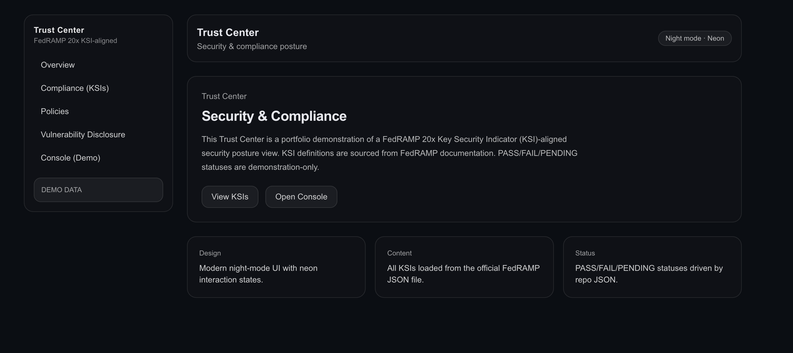
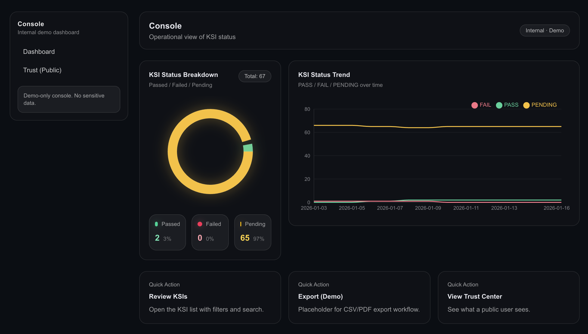
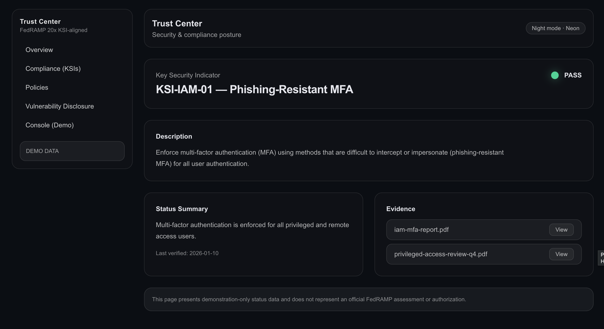

# FedRAMP KSI Trust Center (Demo)

It includes PASS / FAIL / PENDING status tracking, evidence linking, and dashboard charts, built as a portfolio GRC platform demo.

## Features

- Loads all FedRAMP 20x KSIs from JSON (67 items)
- Status mapping (PASS / FAIL / PENDING) driven by repo JSON
- Trust Center pages:
  - Overview
  - Compliance (KSIs) with filter + search
  - KSI detail page per indicator
  - Policies
  - Vulnerability Disclosure
- Console dashboard (internal demo view)
- Charts:
  - Donut breakdown (PASS/FAIL/PENDING)
  - Trend line over time (demo history)
- Evidence linking (demo files served from /public)

## Getting Started

Install dependencies:

```bash
npm install
npm run dev
```
## Screenshots






