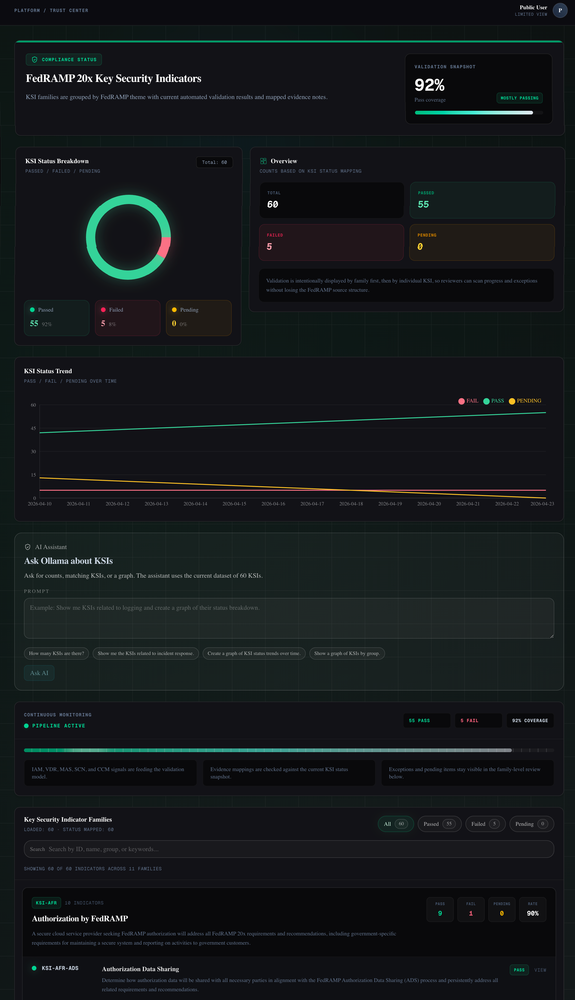
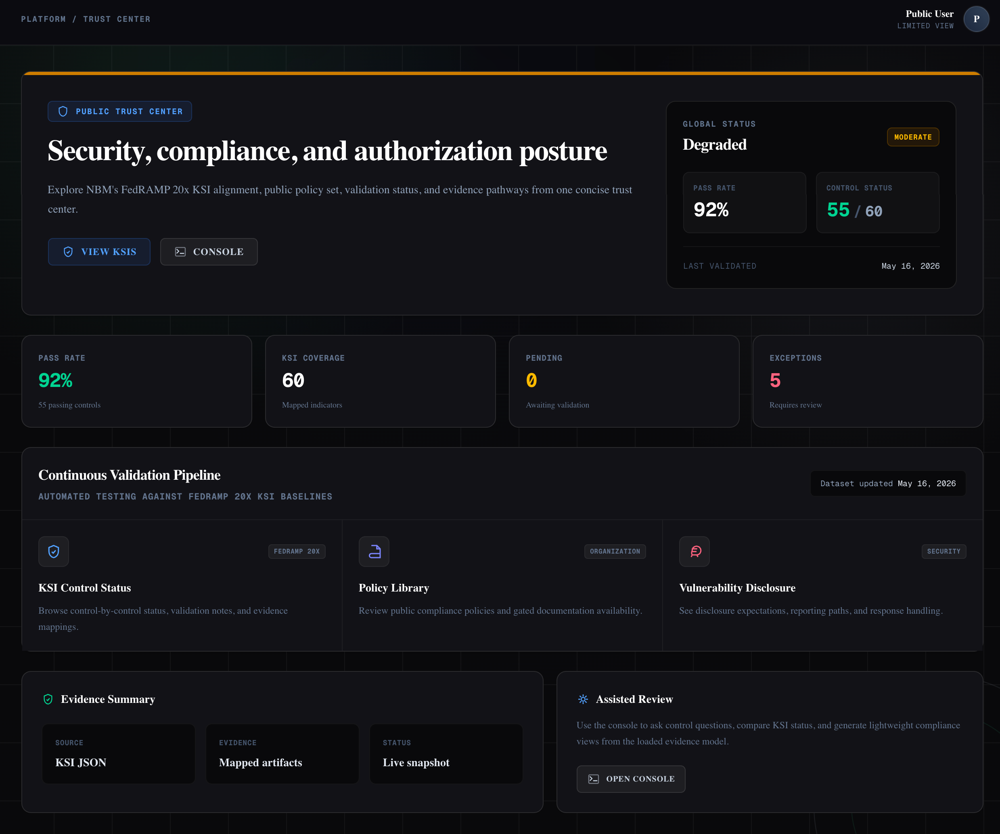

# FedRAMP KSI Trust Center (Demo)

It includes PASS / FAIL / PENDING status tracking, evidence linking, dashboard charts, and an Ollama-backed AI assistant, built as a portfolio GRC platform demo.

## Features

- Loads current FedRAMP 20x KSIs from JSON (60 items across 11 families)
- Uses FedRAMP machine-readable documentation version 0.9.43-beta, last updated 2026-04-08
- Status mapping (PASS / FAIL / PENDING) driven by repo JSON
- Trust Center pages:
  - Overview
  - Compliance (KSIs) with filter + search
  - KSI detail page per indicator
  - Policies
  - Vulnerability Disclosure
- Console dashboard (internal demo view)
- Charts:
  - Donut breakdown (PASS/FAIL/PENDING)
  - Trend line over time (demo history)
- AI assistant with Ollama:
  - Matching KSI results based on the prompt
  - Prompt driven graphs
  - Validation aware responses using browser stored assessor records
- 3PAO KSI validation

## Getting Started

Install dependencies:

```bash
npm install
npm run dev
```

## Screenshots




